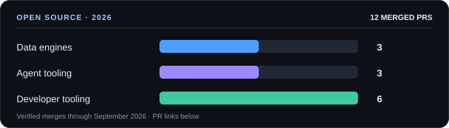

# Hi, I'm Amit 👋

**Computer Science at Durham · Agent infrastructure · Quant systems**

I build tools that route work between AI and people, test trading ideas, and improve the open-source software I use.

   

## What I'm building

| | Project |
|:---:|---|
|  | **[warrant](https://github.com/amitvijapur/warrant)** · [live demo](https://warrant-agentos.netlify.app) Routes work between humans and AI using evidence-based scores. Irreversible actions need signed human approval, and outcomes improve future routing. Built solo; **top 5 of 53** at GenAI Fund Agentic AI Build Week 2026. |
|  | **[cortex](https://github.com/amitvijapur/cortex)** Chooses the workflow, specialist, and effort tier for coding tasks, then logs decisions and learns from outcomes. |
| 📈 | **[multi-factor-equity-screener](https://github.com/amitvijapur/multi-factor-equity-screener)** A public write-up on forward-testing a trading screener. Pre-registered checks caught an inverted ranking model; the implementation is private. |

## Open source

- **Data engines:** [DataFusion](https://github.com/apache/datafusion/pull/24409) (Spark decimal semantics), [Arrow Rust](https://github.com/apache/arrow-rs/pull/11074) (cast-module refactor), and [Ballista](https://github.com/apache/datafusion-ballista/pull/2460) (benchmark failure artifacts).
- **Agent tooling:** [FastMCP](https://github.com/punkpeye/fastmcp/pull/296) (resource subscriptions) and mcp-atlassian ([Jira parent updates](https://github.com/sooperset/mcp-atlassian/pull/1518), [Jira formatting](https://github.com/sooperset/mcp-atlassian/pull/1590)).
- **Developer tools:** [Vercel Chat](https://github.com/vercel/chat/pull/846) (Slack attachments), [Scrapling](https://github.com/D4Vinci/Scrapling/pull/379) (cached browser cookies), [Understand-Anything](https://github.com/Egonex-AI/Understand-Anything/pull/598) (hook input), [last30days](https://github.com/mvanhorn/last30days-skill/pull/851), [git-proxy](https://github.com/finos/git-proxy/pull/1708), and [toolport](https://github.com/btsouth/toolport/pull/366).

## Tech stack

**Languages**

         

**Frameworks, libraries and tools**

         

## Beyond code

Before Durham, I was a 3rd Sergeant in the Singapore Army's Military Police and led a 10-person team. Outside the terminal, I run long distances, take street photos, play guitar, and care a little too much about coffee.
